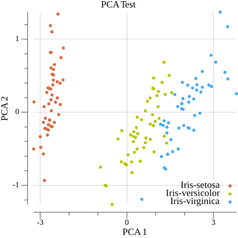

# Go-ML cluster

[](https://pkg.go.dev/github.com/thadUra/Go-ML/cluster)

Package cluster is a machine learning clustering package for Go.

## Example Usage

Below contains example usage of the cluster package on the Iris dataset and a makeMoons sample dataset. These examples can be found in `../tests/cluster_test.go`.

### Principal Component Analysis on Iris
```
    // Test PCA and check for errors
	result, err := cluster.PCA(data, 2)
	if err != nil {
		t.Fatalf(`TestCluster(): failed at building PCA -> "%s"`, err)
	}

	// Generate scatterplot for PCA results
	plot_params := []string{"../tests/misc/pcaTest.png", "PCA Test", "PCA 1", "PCA 2"}
	err = cluster.ScatterPlot2DimenData(result, label, plot_params)
	if err != nil {
		t.Fatalf(`TestCluster(): failed at pca plotting -> "%s"`, err)
	}
```

#### Plot


### K-Means Clustering on Iris
```
    // Test KMeans and check for errors
	km := cluster.NewKMeans(3, 500)
	err = km.Train(result)
	if err != nil {
		t.Fatalf(`TestCluster(): failed at kmeans training -> "%s"`, err)
	}
	result, new_label, err := km.Evaluate(result)
	if err != nil {
		t.Fatalf(`TestCluster(): failed at kmeans evaluation -> "%s"`, err)
	}

	// Generate scatterplot for KMeans results
	plot_params = []string{"../tests/misc/kmeansIrisTest.png", "KMeans Test", "X", "Y"}
	err = cluster.ScatterPlot2DimenData(result, new_label, plot_params)
	if err != nil {
		t.Fatalf(`TestCluster(): failed at kmeans plotting -> "%s"`, err)
	}
```

#### Plot


### Spectral Clustering on MakeMoons
```
    // Test Spectral Clustering and check for errors
	new_label, err = cluster.Spectral(data, 0.4)
	if err != nil {
		t.Fatalf(`TestCluster(): failed at spectral clustering -> "%s"`, err)
	}

	// Generate scatterplot for Spectral Clustering results
	plot_params = []string{"../tests/misc/spectralMoonsTest.png", "Spectral Clustering Test", "X", "Y"}
	err = cluster.ScatterPlot2DimenData(data, new_label, plot_params)
	if err != nil {
		t.Fatalf(`TestCluster(): failed at spectral plotting -> "%s"`, err)
	}
```

#### Plot
